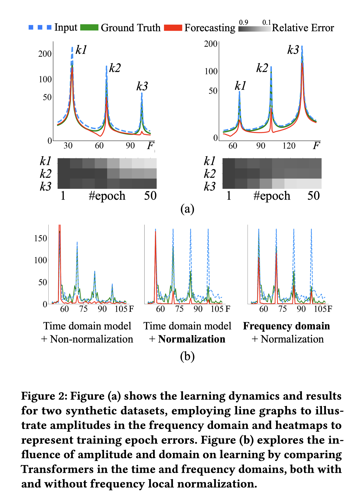
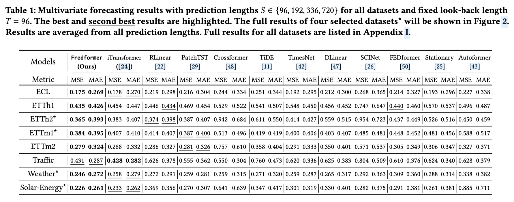

## Fredformer

This is an official implementation of a KDD2024 paper, "Fredformer: Frequency Debiased Transformer for Time Series Forecasting."

## Contribution

Fredformer focuses on addressing **the issue of frequency bias in Transformer models for time series forecasting.** 
This bias can cause the model to fail to capture mid-to-high-frequency information in the data. 
We have **conducted empirical analyses on this issue and proposed a solution** in this work.
Extensive experimental results on eight datasets show the effectiveness of Fredformer.

For more details, please refer to our original paper.




## Dependencies
Fredformer is built based on PyTorch.
You can install PyTorch following the instructions in [PyTorch](https://pytorch.org/get-started/locally/). For example:

```bash
pip install torch==1.10.0+cu111 torchvision==0.11.0+cu111 torchaudio==0.10.0 -f https://download.pytorch.org/whl/torch_stable.html
```
After ensuring that PyTorch is installed correctly, you can install other dependencies via:

```bash
pip install -r requirements.txt
```

## About data:
We have prepared a dataset for this example: Weather. The CSV file is in the dataset folder.

## Custom Data Usage

If you are using your data, please format it as a CSV file, with each row representing a sample and each column representing a channel. 
When selecting the data type "data_name," please choose "Custom" and ensure the CSV file is stored in the `dataset` folder.

## Some main parameters:

- `--patch_len` (int, default=16): Frequency patching length.
- `--cf_dim` (int, default=48): Feature dimension.
- `--cf_drop` (float, default=0.2): Dropout rate.
- `--cf_depth` (int, default=2): Number of Transformer layers.
- `--cf_heads` (int, default=6): Number of multi-heads.
- `--cf_mlp` (int, default=128): Feed-forward network dimension.
- `--cf_head_dim` (int, default=32): Dimension for each single head.
- `--use_nys` (int, default=0): Use Nyström method (0 = No, 1 = Yes).
- `--mlp_drop` (float, default=0.3): Dropout rate for MLP.


## Training. 
For Fredfromer:
The scripts for our are in the directory ```./scripts/Fredformer```.
You can run the following command, then open ```./result.txt``` to see the results once the training is done:
```
sh ./scripts/Fredformer/weather.sh
 ```
Log files will be generated and updated in  ```./logs/``` during training.

## Data Preparation Scripts

All dataset scripts can currently be found in the `scripts/Fedformer/` directory. 

Please note that the Electricity and Traffic datasets use the Nystrom variant of Fedformer by default. If you need to change this, set the value of `--use_nys` to `0` in the corresponding `.sh` file.

```bash
# Example: Modify the use of the Nystrom variant in the shell script for the Electricity dataset
# Open the corresponding script file (e.g., train_electricity.sh) and find the line with --use_nys

# Original line in train_electricity.sh
--use_nys 1

# Modify to disable the Nystrom variant
--use_nys 0
```

## Main Results

Here are the main results of our experiment:



## Citation
If you find our work useful in your research, please consider citing:
```
@inproceedings{Piao2024fredformer,
  title={Fredformer: Frequency Debiased Transformer for Time Series Forecasting},
  author={Xihao Piao and Zheng Chen and Taichi Murayama and Yasuko Matsubara and Yasushi Sakurai},
  booktitle={30th SIGKDD Conference on Knowledge Discovery and Data Mining - Research Track},
  year={2024},
}

```

